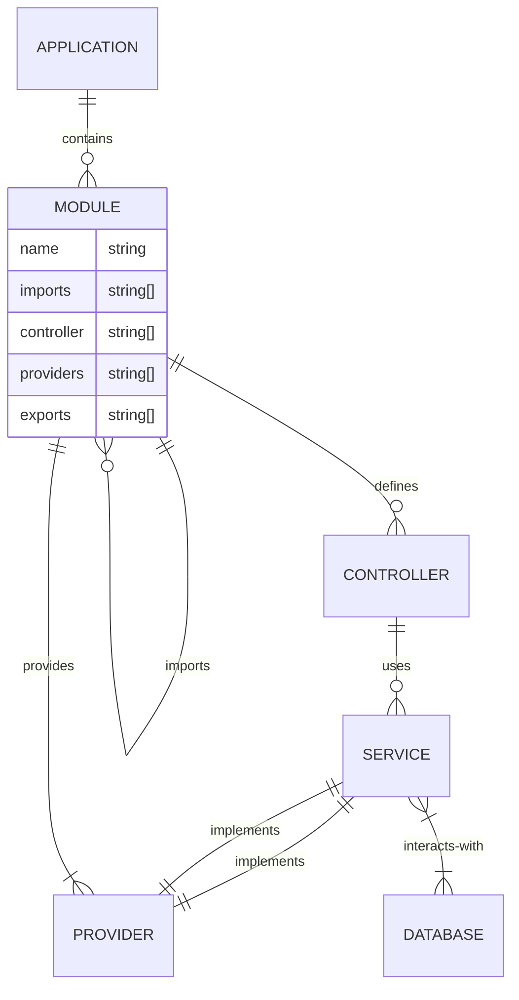

<p align="center">
  <a href="http://nestjs.com/" target="blank"></a>
</p>

[circleci-image]: https://img.shields.io/circleci/build/github/nestjs/nest/master?token=abc123def456
[circleci-url]: https://circleci.com/gh/nestjs/nest

  <p align="center">A progressive <a href="http://nodejs.org" target="_blank">Node.js</a> framework for building efficient and scalable server-side applications.</p>
    <p align="center">
<a href="https://www.npmjs.com/~nestjscore" target="_blank"></a>
<a href="https://www.npmjs.com/~nestjscore" target="_blank"></a>
<a href="https://www.npmjs.com/~nestjscore" target="_blank"></a>
<a href="https://circleci.com/gh/nestjs/nest" target="_blank"></a>
<a href="https://coveralls.io/github/nestjs/nest?branch=master" target="_blank"></a>
<a href="https://discord.gg/G7Qnnhy" target="_blank"></a>
<a href="https://opencollective.com/nest#backer" target="_blank"></a>
<a href="https://opencollective.com/nest#sponsor" target="_blank"></a>
  <a href="https://paypal.me/kamilmysliwiec" target="_blank"></a>
    <a href="https://opencollective.com/nest#sponsor"  target="_blank"></a>
  <a href="https://twitter.com/nestframework" target="_blank"></a>
</p>
  <!--[](https://opencollective.com/nest#backer)
  [](https://opencollective.com/nest#sponsor)-->


- [Description](#description)
- [Installation](#installation)
- [Running the app](#running-the-app)
- [Test](#test)
- [Support](#support)
- [Stay in touch](#stay-in-touch)
- [License](#license)
- [ER Diagram](#er-diagram)
- [Directory Structure](#directory-structure)
- [Mongo](#mongo)
- [CRUD Operations](#crud-operations)
- [Create Dto](#create-dto)
  - [Schema](#schema)
  - [Add into `products.module.ts`](#add-into-productsmodulets)
  - [Add into `products.controller.ts`](#add-into-productscontrollerts)

## Description

[Nest](https://github.com/nestjs/nest) framework TypeScript starter repository.

## Installation

```bash
$ npm install
```

## Running the app

```bash
# development
$ npm run start

# watch mode
$ npm run start:dev

# production mode
$ npm run start:prod
```

## Test

```bash
# unit tests
$ npm run test

# e2e tests
$ npm run test:e2e

# test coverage
$ npm run test:cov
```

## Support

Nest is an MIT-licensed open source project. It can grow thanks to the sponsors and support by the amazing backers. If you'd like to join them, please [read more here](https://docs.nestjs.com/support).

## Stay in touch

- Author - [Kamil Myśliwiec](https://kamilmysliwiec.com)
- Website - [https://nestjs.com](https://nestjs.com/)
- Twitter - [@nestframework](https://twitter.com/nestframework)

## License

Nest is [MIT licensed](LICENSE).

## ER Diagram



## Directory Structure

เมื่อสร้างโปรเจค NestJS จะได้โครงสร้างไฟล์ดังนี้

```bash
├── nest-cli.json
├── package-lock.json
├── package.json
├── src
│   ├── app.controller.spec.ts
│   ├── app.controller.ts
│   ├── app.module.ts
│   ├── app.service.ts
│   └── main.ts
├── test
│   ├── app.e2e-spec.ts
│   └── jest-e2e.json
├── tsconfig.build.json
└── tsconfig.json
```

การสร้างโครงสร้างไฟล์เพิ่มเติม

เราสามารถสร้างไฟล์โดยใช้คำสั่ง `nest generate` หรือ `nest g` โดยตัวอย่างเช่น

```bash
nest generate controller <name>
nest generate service <name>
nest generate module <name>
nest generate provider <name>
```

หรือต้องการสร้างทีเดียว ได้ไฟล์ทั้งหมด เรียกว่าการสร้าง CRUD resource 
โดยใช้คำสั่ง `nest generate resource` หรือ `nest g resource` โดยตัวอย่างเช่น

```bash
nest g resource <name>
```

## Mongo

ติดตั้ง mongoose

```bash
npm i @nestjs/mongoose mongoose
```

เพิ่ม `docker-compose.yml` สำหรับ MongoDB

```bash
touch docker-compose.yml
```

คำสั่งในการ execute docker-compose.yml

```bash
docker-compose up -d
```

คำสั่งในการ stop docker-compose.yml

```bash
docker-compose down
```

คำสั่งในการเช็ค container ที่กำลังทำงาน

```bash
docker ps
```

คำสั่งในการเช็ค container ที่เคยทำงาน

```bash
docker ps -a
```

คำสั่งในการเข้า container

```bash
docker exec -it <container_id> bash
```

คำสั่งในการเข้า mongo shell

```bash
mongosh -u <username> -p <password>
```

คำสั่งในการออกจาก mongo shell หรือ container

```bash
exit
```

เพิ่ม `app.module.ts` สำหรับเชื่อมต่อ MongoDB

```typescript
import { Module } from '@nestjs/common';
import { MongooseModule } from '@nestjs/mongoose';
import { AppController } from './app.controller';
import { AppService } from './app.service';
import { ProductsModule } from './products/products.module';

@Module({
  imports: [
    ProductsModule,
    MongooseModule.forRoot('mongodb://localhost/nest'),
  ],
  controllers: [AppController],
  providers: [AppService],
})
export class AppModule {}
```
## CRUD Operations

เริ่มจากการทำ Dto ก่อน

## Create Dto

`Dto` คือ Data Transfer Object เป็นตัวแทนข้อมูลที่ใช้ส่งไปมาระหว่าง client และ server

ในไฟล์ `create-product.dto.ts` ให้กำหนด object ที่ใช้เป็น request body สำหรับ create product

```typescript
export class CreateProductDto {
  readonly name: string;
  readonly description?: string;
  readonly price: number;
}
```

`?` คือ optional หมายถึงไม่จำเป็นต้องใส่ข้อมูลก็ได้

### Schema

`Entity` คือ object ที่ใช้เป็น model ของ SQL database มักจะใช้งานร่วมกับ TypeORM หรือ Sequelize
ส่วน `Schema` คือ object ที่ใช้เป็น model ของ NoSQL database มักจะใช้งานร่วมกับ Mongoose

เนื่องจากเราใช้ MongoDB ดังนั้นเราจะใช้ mongoose ในการกำหนด schema ของ product

จึงไม่ใช้ Entity แต่ใช้ Schema แทน

สร้าง `schema` folder สำหรับ products module ซึ่งภายใน ให่้สร้างไฟล์ `product.schema.ts`

ในไฟล์ `product.schema.ts` ให้กำหนด schema ของ product

```typescript
import { Prop, Schema, SchemaFactory } from '@nestjs/mongoose';
import { Document } from 'mongoose';

export type ProductDocument = Product & Document;

@Schema()
export class Product {
  @Prop({ required: true })
  name: string;

  @Prop()
  description: string;

  @Prop()
  price: number;
}

export const ProductSchema = SchemaFactory.createForClass(Product);
```

จะมีการ export `Product`, `ProductDocument` และ `ProductSchema` ออกไปใช้งาน

### Add into `products.module.ts`

เพิ่ม `MongooseModule.forFeature` ใน `products.module.ts` สำหรับเชื่อมต่อ schema ของ product

จะมีการ import `Product` และ `ProductSchema` มาใช้งาน

```typescript
  import { Module } from '@nestjs/common';
  import { MongooseModule } from '@nestjs/mongoose';
  import { ProductsController } from './products.controller';
  import { ProductsService } from './products.service';
+ import { Product, ProductSchema } from './schemas/product.schema';

  @Module({
+   imports: [
+     MongooseModule.forFeature([{ name: Product.name, schema: ProductSchema }]),
+   ],
    controllers: [ProductsController],
    providers: [ProductsService],
  })
  export class ProductsModule {}
```

`forFeature` คือ method ที่ใช้เชื่อมต่อ schema ของ product กับ MongooseModule
ภายในมี object ที่มี key คือ `name` และ `schema` โดย

- `name` คือชื่อของ schema
- `schema` คือ schema ของ product

### Add into `products.controller.ts`

ในส่วนของ `product.schema.ts` จะมีการ import `Product` และ `ProductDocument` มาใช้งาน

ในส่วนของ `@nestjs/mongoose` จะมีการ import `InjectModel` 

ในส่วนของ `mongoose` จะมีการ import `Model` และ `InjectModel`

```typescript
  // products.service.ts
  import { Body, Controller, Get, Post } from '@nestjs/common';
  import { CreateProductDto } from './dto/create-product.dto';
  import { ProductsService } from './products.service';
+ import { Product, ProductDocument } from './schemas/product.schema';
+ import { InjectModel } from '@nestjs/mongoose';
+ import { Model } from 'mongoose'
```

ต่อมา สร้าง constructor ใน `ProductsService` และใช้ `@InjectModel` ในการ inject dependencies จาก `mongoose`
ในที่นี้คือ `Product`
และประกาศตัวแปรที่จะเรียกใช้งานใน `ProductsService` คือ `productModel`
ซึ่งมี concept คล้ายๆกับ controller

```typescript
  @Injectable()
  export class ProductsService {
+   constructor(@InjectModel(Product.name) private productModel: Model<ProductDocument>) {}
  ...
  }
```

ลองเรียกใช้ `productModel` ใน `ProductsService` ด้วยการเพิ่ม expression สำหรับ create product

```typescript
  @Injectable()
  export class ProductsService {
    constructor(@InjectModel(Product.name) private productModel: Model<ProductDocument>) {}

+   async create(createProductDto: CreateProductDto): Promise<Product> {
+     const createdProduct = new this.productModel(createProductDto);
+     return createdProduct.save();
+   }
  ...
  }
```

เนื่องจาก `createdProduct.save()` เป็น promise จึงให้ใส่ `async` และ `await` ในการรอให้ promise สำเร็จ

ความเจ๋งของ `Next.js` คือ เมื่อมีการระบุ `async` ใน method ของ service แล้ว การเรียกใช้งานในฝั่ง controller ไม่ต้องระบุ `async` และ `await` อีก

เมื่อลอง request POST ผ่าน Postman จะได้ response ประมาณนี้

```json
{
    "_id": "60f3e3e3e3e3e3e3e3e3e3e3",
    "name": "Product 1",
    "description": "Description 1",
    "price": 1000,
    "__v": 0
}
```

ก็ถือว่าการติดตั้ง Mongoose ใน CRUD สำเร็จแล้ว